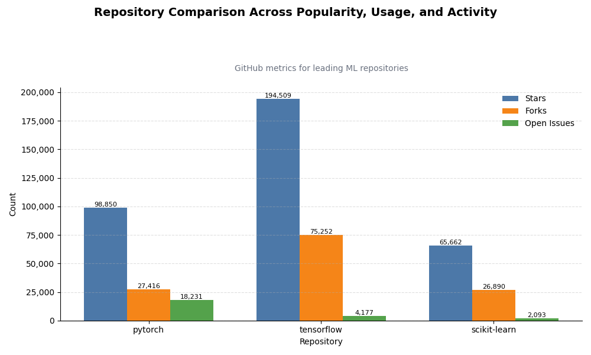

# GitHub Product Analytics Engine

## Overview

This project analyzes GitHub repositories as products using live API data.
It evaluates key performance metrics such as popularity, adoption, and activity to generate actionable insights about developer ecosystems.

Unlike static dataset projects, this system works with real-time data, making the analysis dynamic and closer to real-world product analytics workflows.

---

## Problem Statement

How can we systematically compare and evaluate the performance of different machine learning frameworks using real-world product metrics?

---

## Approach

### 1. Data Collection (API-Based)

* Fetches live repository data from the GitHub REST API
* Eliminates dependency on static datasets
* Ensures real-time and continuously evolving data

### 2. Data Modeling

* Structures API responses into a tabular format using Pandas
* Creates a unified dataset for cross-repository comparison

### 3. Metric Definition

Each repository is evaluated across three core dimensions:

* **Popularity** → Stars (developer interest)
* **Adoption** → Forks (active usage and contribution)
* **Activity** → Open Issues (development intensity and complexity)

### 4. Insight Generation

Transforms raw metrics into meaningful product insights, such as:

* Market dominance
* Developer engagement patterns
* Maintenance and scaling signals

### 5. Visualization

* Uses grouped bar charts for multi-metric comparison
* Focuses on clarity, readability, and decision-making
* Avoids misleading representations by handling scale differences

---

## Sample Output



---

## Tech Stack

* Python
* Pandas
* Matplotlib
* Requests (API integration)

---

## Key Learnings

* Working with live API data instead of static datasets
* Understanding product metrics and their real-world meaning
* Translating raw data into actionable insights
* Designing clean and interpretable visualizations
* Recognizing and correcting misleading data representations (e.g., scale differences)

---

## Why This Project Matters

Most beginner projects focus on static datasets and basic plotting.
This project simulates a real-world analytics workflow by:

* Using live production data
* Framing analysis around product questions
* Emphasizing insight generation over visualization

---

## Limitations

* Uses aggregated metrics rather than granular event-level data
* Limited to a small set of repositories
* Insights are rule-based rather than AI-driven

---

## Future Improvements

* Integrate LLMs for automated insight generation
* Expand to dynamic repository selection
* Add historical trend analysis
* Build an interactive dashboard

---

## How to Run

```bash
pip install -r requirements.txt
python main.py
```
### If you want custom repository

```bash
python main.py pytorch/pytorch tensorflow/tensorflow scikit-learn/scikit-learn
```
---

## Design Decisions

### Why use an API instead of a dataset?

This project uses the GitHub API to work with real-time data instead of static datasets.
This approach better reflects real-world analytics workflows, where data is continuously updated and fetched dynamically.

### Why these metrics?

The selected metrics represent key dimensions of product performance:

* **Stars** → Indicates popularity and developer interest
* **Forks** → Reflects adoption and active usage
* **Open Issues** → Signals development activity and potential complexity

Together, these provide a balanced view of how a repository performs as a product.

### Handling metric scale differences

The metrics differ significantly in magnitude (e.g., stars vs issues), which can lead to misleading visualizations.
Careful visualization design was applied to ensure clarity and accurate comparison.

### Why focus on insights, not just visualization?

The goal of this project is not just to display data, but to interpret it.
Each output is designed to answer a product-level question rather than simply present numbers.

---

## Author

Built as part of a project-based learning approach to understand product analytics and real-world data workflows.
